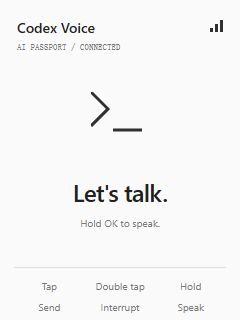

[简体中文](README.zh_CN.md)

# AI Passport Codex Voice

A Windows voice controller for Codex using the FoloToy AI Passport (ESP32-C3).
Board microphone → Wi-Fi PCM → Windows virtual microphone → Codex native dictation.

  

*Idle interface preview*

## Controls

- Tap OK: send. Double-tap OK: interrupt.
- Hold OK for 0.45 seconds: dictate; release to finish. Maximum recording: 30 seconds.
- Tap UP/DOWN: cycle recent chats on release (Ctrl+F7 / Ctrl+F8).
- Hold UP/DOWN: mouse wheel scrolling; release to stop. Keep the pointer over the reply.
- Input is active only while Codex is foreground.

## Setup

1. Install Python on Windows and run `pip install -r requirements.txt`.
2. Provide a Steam Streaming Microphone virtual audio device. Set BOTH playback and recording endpoints to mono, 48000 Hz, 16-bit. Select its recording endpoint in Codex.
3. Configure Codex hold-to-dictate as Ctrl+Shift+D and recent-chat cycling as Ctrl+F7 / Ctrl+F8. These bindings depend on the installed Codex version.
4. Copy `wifi-host.example.json` to `passport-backup/wifi-host.json`. Use the PC LAN IPv4 address and a random shared key (`python -c "import secrets; print(secrets.token_hex(32))"`).
5. Copy `ai-passport-main/main/passport_wifi_config.example.h` to `passport_wifi_config.h` in the same directory. Fill in 2.4 GHz Wi-Fi credentials, the same host address and shared key.
6. With ESP-IDF 5.5.3 active, build using `idf.py -C ai-passport-main build`. Confirm the exact device before flashing. For the existing preserved-partition installation, flash ONLY the application at 0x10000; do not overwrite factory device data.
7. Allow Python TCP port 8765 from your trusted LAN. Run `python passport_wifi_bridge.py`. Keep a fixed PC LAN address.

Configure the virtual audio device and shortcuts manually. Built firmware contains your Wi-Fi password and pairing key; do not share it.

## Notes

Use a trusted LAN: audio transport is unencrypted. The bridge does not save ordinary recordings; Codex handles its own recording retention.
“Audio sent to Codex” is a timed acknowledgement, not confirmation that transcription has completed.
